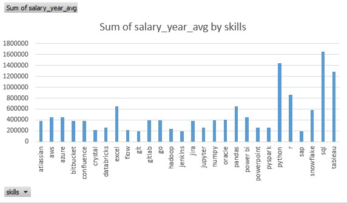

# Introduction

Explore the exciting world of data analytics! This project dives deep into the data job market, spotlighting 💰 top-paying roles, 🔥 must-have skills, and 📈 where high demand meets high salary for data analysts.

🔍 Curious about SQL queries? Find them here: [Sql_Data_analysis_project](https://github.com/Wachacha-jay/Sql_Data_Analysis_Project/tree/main).
# Bacground

Motivated by the need to better understand the data analyst job market, this project Is created to identify high-paying, in-demand skills and help myself and other aspiring data nerds streamline their job search. It emphasizes flexible work opportunities and highlights the best skills to learn for landing optimal roles.

The dataset, sourced from [Kaggle](https://www.kaggle.com/datasets/lukebarousse/data-analyst-job-postings-google-search), provides valuable insights into job titles, salaries, locations, and key skills required in the field.

Through my SQL queries, I aimed to uncover answers to the following questions:

- Which data analyst roles offer the highest salaries?
- What skills are essential for these top-paying positions?
- Which skills are currently the most in demand for data analysts?
- How do specific skills correlate with higher salaries?
- What are the most valuable skills to learn for career growth?
# Tools i Used
For my deep dive into the data analyst job market, I leveraged a suite of powerful tools to extract, analyze, and present insights effectively:

- **SQL:** The core of my analysis, enabling me to query the data and uncover meaningful trends.
- **PostgreSQL:** The database management system I used to store and manage job posting data efficiently.
- **Visual Studio Code and Dbeaver:** My trusted platform for writing and executing SQL queries while managing the database.
- **Git & GitHub:** Vital for version control, sharing SQL scripts, and ensuring seamless collaboration and project tracking.
- **Power BI:** My tool of choice for data visualization, transforming raw data into interactive dashboards and compelling visual insights.
  
# The Analysis
Every query in this project was designed to explore specific facets of the data analyst job market. Here's my approach to addressing each question:

1. Which data analyst roles offer the highest salaries?

To identify the top-paying data analyst roles, I extracted job postings with the highest salaries and matched them to company names using a left join on the company ID from the company dimension table. After removing null salary values, I filtered the results specifically for data analyst roles.

``` SQL
SELECT
	jpf.job_id,
	jpf.company_id,
	jpf.job_title,
	jpf.salary_year_avg,
	jpf.job_location,
	cd.name
FROM
	job_postings_fact jpf
JOIN company_dim cd 
	on
	jpf.company_id = cd.company_id
WHERE
	jpf.salary_year_avg is not null
	AND jpf.job_title_short = 'Data Analyst'
	AND jpf.job_location = 'Anywhere'
ORDER BY
	jpf.salary_year_avg desc
LIMIT
	10;

```
Here’s an overview of the top data analyst jobs in 2024:  

- **Broad Salary Range**: The top 10 highest-paying data analyst roles offer salaries between $250,000 and $650,000, highlighting substantial earning potential in the field.  
- **Diverse Employers**: Leading companies such as SmartAsset, Pinterest, and AT&T are among those offering competitive salaries, demonstrating demand across multiple industries.  
- **Varied Job Titles**: Roles range from Data Analyst to Director of Analytics, showcasing a wide array of positions and specializations within the data analytics domain.  
- **Local Insights**: From my country, I identified a few high-paying roles from companies like Wasoko, prompting me to expand my job search to include remote opportunities for greater flexibility and reach.

*Bar graph visualizing the salary for the top 10 salaries for data analysts; Excel generated this graph from my SQL query results.*

2. What skills are essential for these top-paying positions

To identify the skills required for top-paying jobs, I linked job postings with skills data, uncovering key insights into the qualifications employers prioritize for high-compensation roles.

``` SQL
WITH top_paying_jobs AS (
    SELECT	
        job_id,
        job_title,
        salary_year_avg,
        name AS company_name
    FROM
        job_postings_fact
    LEFT JOIN company_dim ON job_postings_fact.company_id = company_dim.company_id
    WHERE
        job_title_short = 'Data Analyst' AND 
        job_location = 'Anywhere' AND 
        salary_year_avg IS NOT NULL
    ORDER BY
        salary_year_avg DESC
    LIMIT 10
)

SELECT 
    top_paying_jobs.*,
    skills
FROM top_paying_jobs
INNER JOIN skills_job_dim ON top_paying_jobs.job_id = skills_job_dim.job_id
INNER JOIN skills_dim ON skills_job_dim.skill_id = skills_dim.skill_id
ORDER BY
    salary_year_avg DESC;
```
Here’s a summary of the most in-demand skills for the top highest-paying data analyst jobs in 2024:  

Key observations:

- Skills like Jupyter, PySpark, Databricks, Azure, and Power BI stand out with higher average salaries.
- Commonly sought-after tools like SQL, Python, and Tableau also maintain strong salary associations.

 *Here is a bar chart visualizing the average salary associated with each skill. This chart highlights which skills are linked to the highest salaries in the data analyst job market.* 

 3. Which skills are currently the most in demand for data analysts?

This query highlighted the skills most frequently mentioned in job postings, helping to pinpoint areas of high demand.

```SQL
SELECT
	sd.skills,
	count(sjd.skill_id) as skill_demand
FROM
	job_postings_fact jpf
LEFT JOIN skills_job_dim sjd 
	ON
	jpf.job_id = sjd.job_id
JOIN skills_dim sd 
	ON
	sjd.skill_id = sd.skill_id
WHERE
	jpf.job_title_short = 'Data Analyst'
GROUP BY 
	sd.skills 
ORDER BY
	skill_demand desc 
LIMIT 5;
```
Here’s a summary of the most sought-after skills for data analysts in 2024:  

- **SQL and Excel** continue to be essential, highlighting the importance of strong foundational skills in data management and spreadsheet analysis.  
- **Programming and Visualization Tools** such as Python, Tableau, and Power BI are crucial, reflecting the growing emphasis on technical expertise for data-driven storytelling and decision-making.
  
    | Skills	 |  Skill_demand |
    | ------  |  ------------ |
    | Sql	   |  92628        |
    | Excel	 |  67031        |
    | Python	 |  57326        |
    | Tableau |	46554        |
    | Power bi|	39468        | 
 *Table of the demand for the top 5 skills in data analyst job postings*

 4. How do specific skills correlate with higher salaries?
Analyzing the average salaries tied to various skills uncovered which skills command the highest pay.

```SQL
SELECT 
    skills,
    ROUND(AVG(salary_year_avg), 0) AS avg_salary
FROM job_postings_fact
INNER JOIN skills_job_dim ON job_postings_fact.job_id = skills_job_dim.job_id
INNER JOIN skills_dim ON skills_job_dim.skill_id = skills_dim.skill_id
WHERE
    job_title_short = 'Data Analyst'
    AND salary_year_avg IS NOT NULL
    AND job_work_from_home = True 
GROUP BY
    skills
ORDER BY
    avg_salary DESC
LIMIT 25;

```
Here’s a summary of the top-paying skills for Data Analysts:  

- **Big Data and Machine Learning Expertise**: Skills in big data tools like PySpark and Couchbase, machine learning platforms like DataRobot and Jupyter, and Python libraries such as Pandas and NumPy are highly valued, reflecting the demand for advanced data processing and predictive modeling capabilities.  
- **Proficiency in Development and Deployment Tools**: Expertise in tools like GitLab, Kubernetes, and Airflow highlights the lucrative intersection of data analysis and engineering, with high demand for skills that enhance automation and streamline data pipelines.  
- **Cloud Computing Knowledge**: Familiarity with platforms like Elasticsearch, Databricks, and Google Cloud Platform (GCP) showcases the rising significance of cloud-based analytics, with cloud expertise offering a significant boost to earning potential.

  | Skills	   | Avg_salary |
  |------------| -----------|
  | pyspark	   | 208172     |
  | bitbucket	 | 189155     |
  | couchbase	 |  160515    |
  | watson	   |  160515    |
  | datarobot	 | 155486 |
  | gitlab	| 154500 |
  | swift	| 153750 |
  | jupyter |	152777 |
  | pandas	| 151821 |
  | elasticsearch |	145000 |
  | golang |	145000 |
  | numpy	| 143513 |
  | databricks |	141907 |
  | linux	| 136508 |
  | kubernetes |	132500 |
  | atlassian	| 131162 |
  | twilio |	127000 |
  | airflow |	126103 |
  | scikit-learn |	125781 |
  | jenkins	| 125436 |
  | notion	| 125000 |
  | scala	 | 124903 |
  | postgresql |	123879 |
  | gcp	| 122500 |
  | microstrategy	| 121619 |
5. Most Optimal Skills to Learn
By integrating demand and salary data, this query identified skills that are both highly sought-after and well-compensated, providing a strategic guide for skill development.

``` SQL
WITH high_demand AS (
SELECT
	sjd.skill_id,
	sd.skills,
	count(sjd.skill_id) AS demand_count
FROM
	job_postings_fact jpf
LEFT JOIN skills_job_dim sjd 
	ON
	jpf.job_id = sjd.job_id
JOIN skills_dim sd 
	ON
	sjd.skill_id = sd.skill_id
GROUP BY 
	sjd.skill_id, sd.skills 
ORDER BY
	demand_count DESC), high_salary AS(
SELECT
	sd.skill_id,
	count(sjd.skill_id) AS skill_demand_pay,
	round(avg(jpf.salary_year_avg), 0) AS salary_avg 
FROM
	job_postings_fact jpf
LEFT JOIN skills_job_dim sjd 
	ON
	jpf.job_id = sjd.job_id
JOIN skills_dim sd 
	ON
	sjd.skill_id = sd.skill_id
WHERE
	jpf.salary_year_avg is not null
GROUP BY 
	sd.skill_id
ORDER BY
	skill_demand_pay desc, salary_avg desc)
	
SELECT high_salary.skill_id, high_demand.skills, high_salary.salary_avg, high_demand.demand_count
FROM high_demand
JOIN high_salary
	ON high_demand.skill_id = high_salary.skill_id
ORDER BY high_salary.salary_avg desc
LIMIT 10;
```
Based on recent trends in 2024, the data analyst role continues to be shaped by high demand for specific technical skills. Among the top skills optimal and  in demand according to the query above are:

1. **SQL and Excel**: These remain foundational, essential for data processing and analysis. Many job postings continue to highlight these as core requirements, they are the top skills with a huge count in job requirement.
2. **Programming Languages**: Python and R are highly sought after, particularly for their capabilities in data manipulation, statistical analysis, and machine learning. The demand for Python, in particular, is rising due to its role in data automation and advanced analytics.
3. **Visualization and BI Tools**: Tools like Tableau, Power BI, and Looker are pivotal for data storytelling and visualization, crucial for decision-making processes.
4. **Cloud and Big Data Technologies**: Familiarity with platforms like AWS, Azure, and Snowflake is gaining traction, highlighting the trend towards cloud computing in the data analytics space. While this skills have a low demand count they are requiired with the highest paying jobs.
5. **Machine Learning and AI**: While not a core requirement for every data analyst position, knowledge in machine learning tools like PySpark and DataRobot is increasingly becoming a competitive advantage.

These skills are reflective of the growing need for more advanced technical proficiency, as businesses focus on handling large datasets, utilizing cloud-based analytics, and deriving predictive insights. As a result, salaries for roles demanding these skills are significantly higher, especially in industries focusing on big data and machine learning.
# What i Learned
Insights from Each Query:
**Query 1 (Top Paying Skills):** This helped identify that skills in SQL, Python, Tableau, Power BI, and cloud technologies like AWS and Snowflake are highly valued in top-paying data analyst roles.
**Query 2 (Demand vs. Salary Analysis):** It revealed that while SQL and Excel are foundational, newer skills like cloud computing and advanced programming (e.g., Python) offer a higher earning potential.
**Query 3 (Job Title and Skill Frequency):** The analysis showed a high demand for varied skills in job titles across data analyst roles, indicating that data analysts need to be versatile and adaptable.
**Query 4 (Skill Demand Over Time):** This query demonstrated that demand for cloud skills (e.g., AWS, Azure) and data visualization tools like Tableau has been consistently high in recent job postings.
# Conclusion:
Doing this project has sharpened my SQL skills and prepared me for data analyst roles in the current job market. The ability to manipulate data, analyze trends, and draw insights from complex data sets is highly valued.

Key takeaways from this project include the importance of developing a diverse skill set in programming, cloud computing, data visualization, and foundational data processing (e.g., SQL and Excel).
Future Skill Development: Continuing to refine these skills, especially in cloud computing, machine learning, data visualization, and programming (e.g., Python), will position data analysts well for roles in data science, big data analytics, and advanced data processing.

This project has provided practical insights into the data analyst role's requirements and trends, helping me refine my approach to skill development and career planning in data analytics.


